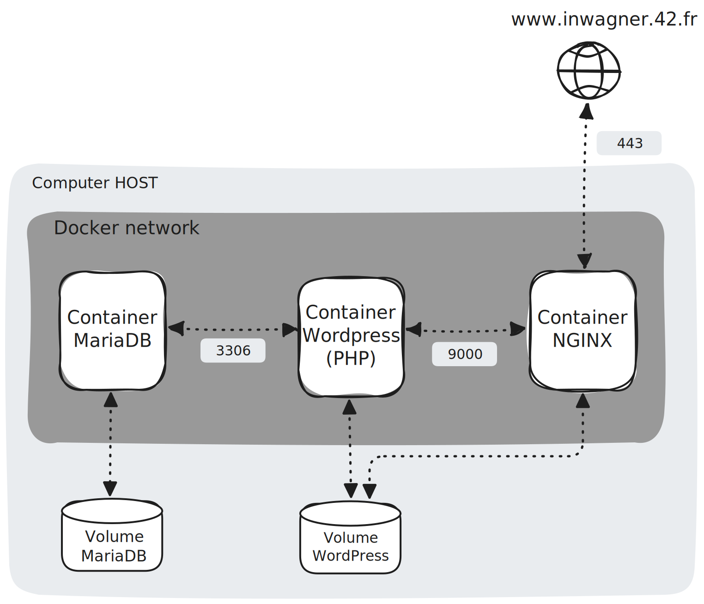

# 42 Cursus - Inception


Este projeto consiste no aprendizado sobre Docker e na criação de ambientes de produção com containers. Dentre os componentes envolvidos, temos o NGINX, WordPress, MariaDB, volumes e rede personalizada. Os Dockerfiles devem configurar variáveis de ambiente, criar as imagens de cada serviço e garantir a reinicialização automática em caso de falhas, sem uso de loops infinitos. A orquestração será realizada por meio de um arquivo docker-compose.yml, e a automação da construção será feita por um Makefile.

## WebApp Architecture 

A aplicação está organizada em uma arquitetura modular e isolada por responsabilidades. Todos os containers estão conectados à mesma docker network, permitindo comunicação interna entre eles sem expor portas desnecessárias para fora da rede.



- **WWW (usuário final)**: As requisições do usuário chegam pela web via protocolo HTTPS (SSL/TLS) na porta 443, que é exposta pelo container NGINX. Essa camada garante a comunicação criptografada entre o cliente e o servidor, protegendo dados sensíveis e aumentando a segurança da aplicação.

- **NGINX (servidor web)**: O container NGINX atua como um proxy reverso seguro, responsável pelo roteamento das requisições recebidas:
	- Termina conexões SSL/TLS, descriptografando as requisições HTTPS.
	- Redireciona as requisições dinâmicas para o container WordPress, utilizando a porta 9000.
	- Serve arquivos estáticos armazenados em um volume compartilhado com o WordPress, como imagens, temas e uploads.

- **WordPress (Aplicação PHP)**: O container WordPress é o coração da aplicação, responsável por renderizar o site e fornecer a interface de gerenciamento de conteúdo (CMS).
	- Comunica-se com o NGINX internamente pela porta 9000.
	- Conecta-se ao banco de dados MariaDB via porta 3306.
	- Utiliza um volume dedicado para armazenar conteúdos persistentes como mídias e configurações.

- **MariaDB (Banco de dados relacional)**: O container MariaDB armazena todas as informações estruturadas da aplicação WordPress, incluindo posts, páginas, usuários e configurações internas.
	- Recebe conexões do WordPress pela porta 3306.
	- Utiliza um volume dedicado para garantir persistência dos dados do banco mesmo após reinicializações do container.


### Directory Structure

O projeto é dividido em camadas para melhor organização e modularização dos containers. Segue a estrutura do diretório:

```
📁 inception/
├── ⚙️ Makefile
└── 📁 srcs/
	├── 📄 .env
	├── 📦 docker-compose.yml
    └── 📁 requirements/
        ├── 📁 nginx/
        │   ├── 🐳 Dockerfile
        │   ├── 📄 .dockerignore
        │   ├── 📁 conf/
        │   └── 📁 tools/
        │
        ├── 📁 mariadb/
        │   ├── 🐳 Dockerfile
        │   ├── 📄 .dockerignore
        │   ├── 📁 conf/
        │   └── 📁 tools/
        │
        ├── 📁 wordpress/
        │   ├── 🐳 Dockerfile
        │   ├── 📄 .dockerignore
        │   ├── 📁 conf/
        │   └── 📁 tools/
        │
        ├── 📁 redis/
        │   ├── 🐳 Dockerfile
        │   ├── 📄 .dockerignore
        │   ├── 📁 conf/
        │   └── 📁 tools/
        │
        ├── 📁 ftp/
        │   ├── 🐳 Dockerfile
        │   ├── 📄 .dockerignore
        │   ├── 📁 conf/
        │   └── 📁 tools/
        │
        ├── 📁 adminer/
        │   ├── 🐳 Dockerfile
        │   ├── 📄 .dockerignore
        │   ├── 📁 conf/
        │   └── 📁 tools/
        │
        └── 📁 tools/
```
